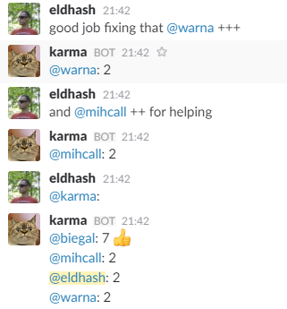

# Elkarmo

Slack karma bot written in Elixir. Allows to add (or remove) karma points to other teammates.



* Use `@mention` followed by ++ or -- (up to 5 +/-) to add/remove karma points to selected user.
* Talk to the bot directly or use simple mention to display the current stats.
* Use `@your_bot_name: reset` to reset karma stats.

Karma points are stored using [DETS](http://erlang.org/doc/man/dets.html) in `karma_db` file.

This project uses the [Elixir-Slack](https://github.com/BlakeWilliams/Elixir-Slack) library to communicate with Slack.

**There is a [blog-post](http://happyteam.io/blog/2016/10/03/how-to-build-karma-slack-bot-in-elixir/) which describes how this bot was built.**

## Installation

* [Create a new bot user](https://my.slack.com/services/new/bot) for your Slack team.
* Get the token for your newly created bot and paste it in the configuration `config/config.exs`:
```elixir
config :elkarmo, slack_token: "YOUR_SLACK_TOKEN_HERE"
```
* You can run the app via `mix run --no-halt`, `iex -S mix` or create a redistributable package using [exrm](https://exrm.readme.io) (`mix release`).
